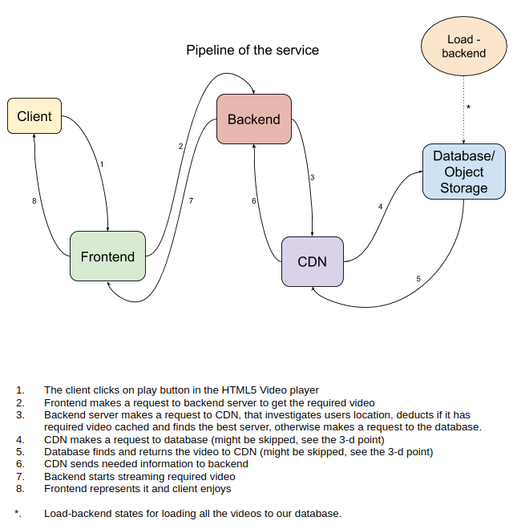

# Design Document
## Contributors
- Alexandra Latysheva ([@alexelex](https://github.com/alexelex))
- Artem Belyakov ([@belyakov-am](https://github.com/belyakov-am))
- Diana Zagidullina ([@dianazagidullina](https://github.com/dianazagidullina))
- Aliia Khasanova ([@khasanovaa](https://github.com/khasanovaa))
- Maria Polyakova ([@mashapolyakova](https://github.com/mashapolyakova))

## Overview
This document envisions a design proposal for a new streaming (Netflix-like) service. 
It will be implemented using the HTML5 video player, S3 (or PostgreSQL for local development)
as a database to store all the videos and CDN to improve loading speed time and 
increase content availability and redundancy.

## Background
As the global pandemic is in full swing, streaming services become more and more popular. 
Only during the first month of lockdown Netflix got 16 million sign ups. 
That led to the growth of its net worth: company's shares have provided a total return 
of 46.9% over the past 12 months. That’s why we decided to create our own Netflix-like 
platform and sell it by 123$ billion in a couple of years.

Along with that we will try our best to catch up on our university project.

## Milestones
*Start date:* January 30, 2021

- [x] Implement a simple backend-server that will deal with HTML5 and represent video 
      (that will be stored locally) on a simple browser page.
- [x] Upload a couple of videos to the db, deploy the backend-server and db in the AWS cloud. Connect them.
- [x] Add CDN to the pipeline.
- [x] Implement some easy front-end features: list of the content, sorting, 
      short description (maybe trailers) of the films. Use REST API to connect all this with the backend.
- [x] Implement more player features, such as subtitles, intro skipping, bitrate and speed changing.
- [ ] Upload more videos. Set benchmarks.
- [ ] Finish front-end create a beautiful awesome wonderful web-site.

*Finish date:* March 20, 2021

## Proposed solution

### Services

**CDN**: AWS CloudFront; for development

**Database**: AWS S3 (object storage); for development use local filesystem with PostgreSQL

**Backend (+Load-backend)**: REST API using Python/Go

**Frontend**: HTML, JavaScript (maybe more modern frameworks like Angular/React)

### Architecture & Pipeline

## Detailed design
**Pick the video**: The user interface is the website. There will be an opportunity 
to search for a film, list all of them, sort, see a short description of the film and play it.

This will be implemented with the help of JavaScript frontend, REST API, Python/Go for a backend.

**Playback**: While playing the video, the user will be able to change the speed and bitrate,
turn on subtitles, play it back.

This will be implemented with HTML-5 features.

**Uploading videos**: videos will be uploaded to Database/Object Storage with Load-backend. 
Ideally provide a handle for admins thus they can upload videos easily without directly accessing AWS console.

## Open questions
- How to deal with bitrate?
- How to properly connect CDN with frontend?
- Do we really need the backend part between the frontend and CDN?
- Does HTML5 provide all the features (if not, probably check AWS CloudFront for required features)?
